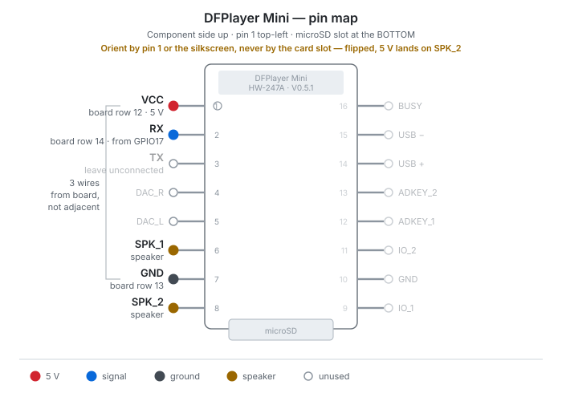

# Wiring — K-2SO head

Hardware companion to the firmware, written for someone building this for the
first time. It covers two stages:

- **Part 1 — Breadboard prototype.** No soldering. Get every component
  working and every pin proven before anything becomes permanent.
- **Part 2 — Moving to PCB.** The same circuit on a solderable perfboard,
  built as a proper power junction and cable breakout.

Both stages are real builds that were used on this project. Part 1 ran for
weeks; Part 2 is the version in the head now.

Parts and where to buy them: see [bom.md](bom.md).

> **Status:** complete and verified 2026-08-09. The Part 2 board worked on
> first power-up; the DFPlayer was added the same day and audio, lights,
> servos and Bluetooth are all confirmed working together on the finished head.

## Pin assignments

These are the same in both stages. They must match the active board config in
`main/board_configs/esp32_devkitc.h`; if you move a wire, move the `#define`
too, because nothing in the source hardcodes a pin.

| Function              | ESP32 pin      | Firmware define        |
| --------------------- | -------------- | ---------------------- |
| LED cluster A — DIN   | GPIO25         | `LED_STRIP_GPIOS[0]`   |
| LED cluster B — DIN   | GPIO26         | `LED_STRIP_GPIOS[1]`   |
| PCA9685 — SDA         | GPIO21         | `I2C_SDA_GPIO`         |
| PCA9685 — SCL         | GPIO22         | `I2C_SCL_GPIO`         |
| DFPlayer — RX         | GPIO17         | `AUDIO_TX_GPIO`        |
| DFPlayer — TX         | GPIO16         | `AUDIO_RX_GPIO` *(reserved, not wired — see below)* |

**If you use a WROVER module instead of a WROOM,** GPIO16/17 are wired to the
PSRAM and are *not* free. Move the DFPlayer to GPIO32/33 and update the board
config.

**Your ESP32 board and your breakout board have to match.** This project uses
a screw-terminal breakout module made specifically for the ESP32-DevKitC, and
it also lines up with the pre-drilled mounting holes in the head's base plate.
An Elegoo ESP32 board bought earlier would not seat in it — the pin ordering
is different, even though the chip is the same. "ESP32 dev board" is not a
standard footprint. Buy the breakout and the dev board as a pair, or check the
pinouts against each other before ordering.

## Power principles

These apply at both stages and are the difference between a build that works
and one that browns out mysteriously.

**Power everything from an external 5 V supply, not from the ESP32's
regulator or USB.** The ESP32's 3.3 V regulator cannot feed WS2812s or servos.
Fourteen WS2812s at full white is roughly 840 mA on their own; two servos
under load add more.

**Use a star topology, not a chain.** Every device takes its own branch from
the 5 V rails. No device's supply current should pass through another
device's ground return.

```
  5 V PSU ──> rails ──┬── 1000 µF bulk capacitor
                      ├── ESP32 (VIN)
                      ├── PCA9685 V+  (servo power)
                      ├── LED cluster A
                      ├── LED cluster B
                      └── DFPlayer Mini
```

**The PCA9685 has two separate power inputs and they are not the same thing.**
`V+` is servo power and comes from the 5 V rails. `VCC` is logic power and
comes from the ESP32's **3.3 V** pin. Wiring VCC to 5 V is a common first
mistake.

**Bulk capacitance goes across the rails, close to the supply entry.** It
absorbs the current spikes when servos start moving or the LEDs jump from off
to full white. Electrolytics are polarised — the striped leg is negative, and
backwards means a bang.

**Do not run external 5 V and USB at the same time** unless you know what your
board's USB/VIN diode arrangement does.

> A real failure from this project: an early firmware started a WiFi soft-AP at
> boot, and over USB alone that pushed the board into brownout — the on-board
> red LED blinked instead of holding solid. The AP now starts *off* and is
> toggled by D-pad Up, which fixed it. If you make the AP always-on, redo the
> current budget.

---

# Part 1 — Breadboard prototype

## Why start here

Every wire is reversible. You will get a pin wrong, a polarity backwards, or a
library misconfigured, and on a breadboard that costs seconds instead of
desoldering. Do not skip to soldering because the circuit "looks simple" — the
point of this stage is not the circuit, it's proving the *firmware* against
real hardware.

## Board used

A 30-row × 5-column breadboard with a single `+`/`−` rail pair on the **right**
side. Any standard breadboard works; row numbers below are specific to this
one, so translate freely.

Breadboard node rule: the five holes in a row (columns 1–5) are one electrical
node. The rails are continuous vertical strips.

## Layout

| Row(s) | Connection                                                        |
| ------ | ----------------------------------------------------------------- |
| 30     | 5 V supply in — `+` to `+` rail, `−` to `−` rail                   |
| 28     | 1000 µF capacitor, `+` leg in `+` rail, `−` leg in `−` rail        |
| 26     | 1000 µF capacitor, same orientation                               |
| 19     | `−` rail → PCA9685 **GND** terminal                               |
| 18     | `+` rail → PCA9685 **V+** terminal                                |
| 15     | `−` rail → ESP32 baseboard **GND** push-in terminal               |
| 14     | `+` rail → ESP32 baseboard **5V in** push-in terminal             |
| 9      | col 5 → **GPIO26**;  col 1 → 330 Ω → row 4                        |
| 8      | col 4 → **GPIO25**;  col 2 → 330 Ω → row 5                        |
| 5      | col 5 + rails → WS2812 cluster **A** (DIN, 5 V, GND)              |
| 4      | col 5 + rails → WS2812 cluster **B** (DIN, 5 V, GND)              |

Plus four wires running **directly** between the PCA9685 and the ESP32, not
through the breadboard: SDA→GPIO21, SCL→GPIO22, VCC→**3.3 V**, GND→GND.

And two servos plugged straight into PCA9685 channels 0 (pan) and 1 (tilt).

Note the data lines cross: GPIO26 feeds the cluster on row 4, GPIO25 feeds the
one on row 5. If your left and right eyes respond to the wrong trigger, swap
the two numbers in `LED_STRIP_GPIOS` rather than rewiring.

## Gotchas that cost real time here

- **Your USB cable must be a data cable.** A charge-only cable powers the
  board — the red LED comes on, everything looks fine — but no COM port
  appears in Device Manager and flashing fails with confusing errors. This
  cost an entire debugging session on this project.
- **Close the serial monitor before flashing.** A held-open COM port gives
  "port busy" or `WinError 31`.
- **The WS2812 clusters here are 7 LEDs in one package**, with separate DIN
  and DOUT pins, not daisy-chained to each other. `LED_STRIP_LED_COUNTS` must
  say `{ 7, 7 }`. Getting this wrong shows up as only the centre pixel
  responding — which looks like a pattern bug and is not.
- **Servo linkages: zero them before attaching.** Set
  `kServoZeroingMode = true` in `main/sketch.cpp`, flash, attach the linkages
  at that known position, then set it back to `false` and reflash.

## Before moving to Part 2

Confirm all of it works on the breadboard first:

- [ ] Both LED clusters light, all 7 pixels each, on every pattern
- [ ] Triggers dim each side independently
- [ ] Both servos sweep from the right stick, and idle motion runs when the
      controller is disconnected
- [ ] The board runs from external 5 V with USB unplugged, without brownout

---

# Part 2 — Moving to PCB

## Why move

The breadboard works, but contacts loosen with vibration, and a head full of
servo movement is vibration. Soldering also lets you replace a nest of
point-to-point jumpers with one power junction and three keyed connectors, so
the head can be opened and reassembled without re-deriving what plugs where.

## Board and coordinate system

A solderable perfboard: 15 rows, columns A–J, with a `+`/`−` rail pair on
**both** the left and right edges. 2.54 mm pitch throughout.

- **Rail order is `+` then `−`, left to right, on both sides.** So `+` is the
  *outer* strip on the left and the *inner* strip on the right. It is not
  mirrored — verify this on your own board before cutting anything.
- **Node rules:** A–E in a given row is one electrical node. F–J in that same
  row is a separate node. The centre channel breaks them. Each rail is one
  continuous vertical strip.

Because F–J is a single node, a connector pin and a jumper anywhere else in
that same row are the same electrical point. That fact drives the layout
below: the connector sits toward the middle of the bank and the jumpers leave
from column J, without needing a wire between them.

The same rule on the other side is what makes the screw terminals work.
Rows carrying power land only in the F–J bank, so the A–E half of those rows
is dead space available for anything convenient.

## Devices on this board

| Device        | Connector    | Signal | ESP32 pin |
| ------------- | ------------ | ------ | --------- |
| LED cluster A | 3-pin JST-XH | DIN    | GPIO25    |
| LED cluster B | 3-pin JST-XH | DIN    | GPIO26    |
| DFPlayer Mini | 3-pin JST-XH | RX     | GPIO17    |

The PCA9685 and ESP32 take *power* from this board via screw terminals, but
their signal wiring (I²C, servo leads) still runs directly between those two
modules and does not touch this board.

## The repeating device motif

All three devices use an identical 4-row block, which is the whole reason this
layout stays readable:

```
            A  B  C  D  E   ‖   F  G  H  I  J    R+  R−
  row n     ·  ·  ·  ·  ·   ‖   ·  ▣  ·  ·  ●────●   ·     5 V    -> + rail
  row n+1   ·  ⊗  ·  ·  ·   ‖   ·  ▣  ·  ·  ●────────●     GND    -> − rail
  row n+2   ·  ○  ·  ·  ●──[R]──●  ▣  ·  ·  ·    ·   ·     signal -> GPIO
  row n+3   ·  ·  ·  ·  ·   ‖   ·  ·  ·  ·  ·    ·   ·     (spare)

  ▣  3-pin JST-XH connector pin, column G (body spans F–H)
  ●  jumper solder point
  ○  GPIO landing — live pin of the screw terminal
  ⊗  dead pin of that same terminal
 [R] 330 Ω, bridging the centre channel on its natural lead spacing
```

Connector pin order is **5 V, GND, signal** top to bottom, the same for all
three, so no cable can be built backwards by accident.

Column G is not special — anywhere in F–I works, since the whole bank is one
node per row. Keep the body clear of column J so the jumper pads stay
accessible.

### Why the jumpers leave from column J

Landing a jumper on the connector's own column means soldering a wire onto a
pad already occupied by a connector lead — doable, but it is the most awkward
joint on the board and the least mechanically sound. Column J is the same
node, gets its own pad, sits clear of the connector body so a jumper can be
reworked without desoldering a connector, and is the shortest run to the rail.

## Placement — rails

| Position    | Row | Component                                    |
| ----------- | --- | -------------------------------------------- |
| Left rails  | 1   | 2-pin screw terminal — **POWER IN** from PSU |
| Left rails  | 8   | 1000 µF electrolytic (`+` leg to `+` rail)   |
| Left rails  | 15  | 2-pin screw terminal — **PCA9685** V+ / GND  |
| Right rails | 1   | 2-pin screw terminal — **ESP32** VIN / GND   |
| Right rails | 15  | 2-pin screw terminal — **AUX** (spare)       |

Terminal blocks are 2 pitches wide and 3 rows long, so pushing them to rows 1
and 15 keeps rows 3–14 fully accessible. The capacitor sits at row 8 where
nothing else needs pad access; a 1000 µF can is about 10 mm across (~4 rows)
and may overhang the board edge.

One capacitor here replaces the breadboard's two, because a single star
junction needs one bulk reservoir rather than one per feed point.

## Placement — devices (F–J bank)

| Device        | Connector | 5 V jumper | GND jumper | Resistor | GPIO landing |
| ------------- | --------- | ---------- | ---------- | -------- | ------------ |
| LED cluster A | G4–G6     | J4 → R+    | J5 → R−    | E6↔F6    | B6 → GPIO25  |
| LED cluster B | G8–G10    | J8 → R+    | J9 → R−    | E10↔F10  | B10 → GPIO26 |
| DFPlayer Mini | G12–G14   | J12 → R+   | J13 → R−   | E14↔F14  | B14 → GPIO17 |

GPIO17 is the ESP32's **TX** and lands on the DFPlayer's **RX** — serial
lines cross. Wiring TX to TX fails silently, with no error to point at it.

### Optional: screw terminals at the GPIO landings

Fitting a screw terminal at B6 / B10 / B14 lets the GPIO wires be swapped
without a soldering iron. Single-pin 2.54 mm blocks are hard to find, so this
build used **2-pin blocks mounted vertically and wired on one side only**:

- Rotate the block 90° so its two pins span two *rows* in column B rather than
  two columns in one row.
- **Put the dead pin above**, so each block occupies **B5+B6, B9+B10 and
  B13+B14** with only the lower screw wired.

This is electrically clean because A–E in each row is a separate node — the
two pins land on two different nodes, and the block's own pins are not
connected to each other internally. The unused pin is a dead stub, not a
short.

Upward is the better direction, and not arbitrarily. The row above each GPIO
landing is that device's **GND** row, which connects over in the F–J bank —
so its A–E half is guaranteed unused. Pointing the block downward would put
the dead pin on the spare row below, which is the only free row left in each
block and worth keeping clear for whatever gets added later.

One thing to check when placing them: **rotated, the body is 3 columns wide
instead of 3 rows long.** Sitting over columns A–C it covers pads on the same
node anyway, so nothing is lost — but keep it clear of column E, where the
resistor lead lands.

## Underside wiring

Eight wires, all horizontal — no diagonals, nothing crossing.

| # | From     | To        | Row | Carries           |
| - | -------- | --------- | --- | ----------------- |
| 1 | Left `+` | Right `+` | 3   | full board 5 V    |
| 2 | Left `−` | Right `−` | 3   | full board ground |
| 3 | J4       | Right `+` | 4   | LED A 5 V         |
| 4 | J5       | Right `−` | 5   | LED A ground      |
| 5 | J8       | Right `+` | 8   | LED B 5 V         |
| 6 | J9       | Right `−` | 9   | LED B ground      |
| 7 | J12      | Right `+` | 12  | DFPlayer 5 V      |
| 8 | J13      | Right `−` | 13  | DFPlayer ground   |

Both rail links share row 3, straight across. Rail-to-rail span is **14
pitches = 35.56 mm**, and it is the same distance for `+`→`+` as for `−`→`−`,
because the rail ordering is identical on both sides rather than mirrored.

### Wire gauge

This build used **20 AWG solid core throughout**, including the rail links,
and that is what is in the head now. One gauge for every jumper means no
sorting mid-build.

20 AWG is 0.81 mm and perfboard holes are around 1.0 mm, so it is close to the
practical maximum for 2.54 mm board — it seats fine but it is stiff, and tight
bends near a pad want a little care. If you would rather have easier handling,
22 AWG is plenty: the rail links carry the whole board's peak of roughly 3 A,
which 22 AWG handles comfortably over a 36 mm run, and the individual device
jumpers carry a fraction of that over 5 mm.

Solid, not stranded — it feeds through the holes and stays put while you
solder. Stranded wants a third hand.

## Assembly order

Lowest components first, so nothing blocks iron access:

1. The three 330 Ω resistors (rows 6, 10, 14), bridging the centre channel.
2. All eight underside jumpers. **Test continuity rail-to-rail now,** before
   anything obstructs the pads.
3. The three 3-pin JST-XH connectors (G4–G6, G8–G10, G12–G14).
4. The three GPIO screw terminals (B5+B6, B9+B10, B13+B14), dead pin up.
5. The five rail screw terminals (rows 1 and 15, both rail pairs).
6. The 1000 µF capacitor last — **check polarity**, `+` leg to the `+` rail.

Before applying power the first time:

- [ ] No continuity between `+` and `−` (cap removed or fully discharged)
- [ ] Continuity from left `+` to right `+`, and left `−` to right `−`
- [ ] Each connector's 5 V pin reaches `+`, each GND pin reaches `−`

---

## Resistors (both stages)

All three are **330 Ω** — orange · orange · brown · gold on a 4-band part, or
orange · orange · black · black · brown if yours are 5-band metal film. Read
from the end *away* from the gold tolerance band; backwards, 330 Ω reads as
130 Ω.

| Ref | Line                 | Purpose                               |
| --- | -------------------- | ------------------------------------- |
| R1  | GPIO25 → LED A DIN   | Series termination, damps reflections |
| R2  | GPIO26 → LED B DIN   | Series termination, damps reflections |
| R3  | GPIO17 → DFPlayer RX | Edge damping / noise                  |

R1 and R2 also limit current into the first pixel's input protection diode if
data goes live before that cluster's 5 V comes up.

R3 is commonly specified as **1 kΩ** in DFRobot's wiring guide, but that value
targets **5 V** hosts, where the resistor limits current into the module's
3.3 V input clamp. The ESP32 drives GPIO17 at 3.3 V, matching the DFPlayer's
own logic level, so that hazard does not exist here. At 9600 baud a bit is
104 µs; with ~50 pF of wiring capacitance, 330 Ω gives an RC of ~17 ns and
1 kΩ gives ~50 ns — both irrelevant. The lower value is marginally better for
noise immunity, keeping the input stiffly driven on a wire bundled near servo
PWM and WS2812 edges.

If audio commands ever garble — wrong track, spurious playback — swapping R3
to 1 kΩ is a two-minute rework. Avoid 10 kΩ: it would probably work, but it
leaves a high-impedance CMOS input on the noisiest wire bundle in the head.

## Connecting the DFPlayer Mini

The cable side of the row 12–14 connector. The DFPlayer is a 16-pin module,
8 per side, and the three pins it needs from this board are **not** adjacent:



**Orient the module by pin 1 or the silkscreen, never by the card slot.** With
VCC at the top-left, the microSD slot is at the **bottom** edge and the
`DFPlayer Mini` marking runs across the top. Reaching for the slot as the
"top" turns the module 180°, which lands your 5 V wire on SPK_2 and ground on
RX — the one mistake here with real potential to destroy something.


| Board row | Signal | DFPlayer pin |
| --------- | ------ | ------------ |
| 12 | 5 V | **VCC** — pin 1 |
| 13 | GND | **GND** — pin 7 (pin 15 is the same net if it routes better) |
| 14 | signal | **RX** — pin 2 |

VCC and RX sit together at pins 1–2, but GND is five pins down the same side,
so that third conductor runs along the module rather than joining the other
two. Leave a little slack in it so it isn't under tension.

**Count from the VCC end rather than eyeballing it.** RX is pin 2 and TX is
pin 3, right next to each other, so an off-by-one puts the GPIO17 wire on TX —
and that fails completely silently. The module powers up, its LED behaves
normally, and nothing ever plays. Leave TX unconnected; the driver never reads
it.

The speaker goes to the **two SPK pins — positions 6 and 8** on the same side
as VCC, either side of GND — and **not** to DAC_L / DAC_R. Those two pairs
look interchangeable and are not: SPK drives a bare speaker from the onboard
amp, while DAC is line-level output for an external amplifier. A speaker on
the DAC pins is barely audible.

Which SPK pin is labelled `_1` and which `_2` **varies between DFPlayer
variants** — DFRobot's original has SPK2 at position 6, while the HW-247A
clone used here has SPK_1 there. It makes no difference: they are the two ends
of one bridged output, so swapping them inverts phase, which is inaudible on a
single speaker. Trust the silkscreen on your own module, and note the position
relative to GND rather than the number.

### The microSD card

Files go in an `mp3` folder at the card root, named with **four digits** —
`/mp3/0001.mp3`, `/mp3/0002.mp3`, and so on. `AUDIO_TRACK_COUNT` in the board
config must equal how many are there. That folder addressing is deliberate:
the flat track index depends on the order files were physically written to the
card and is not reliable.

**Format the card FAT32, and use one of 32 GB or smaller.** Two traps here,
both of which fail the same silent way — the module simply never plays
anything, indistinguishable from a wiring fault:

- **exFAT does not work.** The DFPlayer reads FAT32 and FAT16 only. Windows
  offers exFAT by default for larger cards and will happily format one that
  the module cannot read at all.
- **Cards above 32 GB are out of spec.** Windows also will not format above
  32 GB as FAT32 through its normal dialogs, which is a useful hint that you
  have reached for the wrong card.

A 16 GB card arrives FAT32 from the factory and needs no formatting. Check
before reformatting anything — the card in this build already held a photo
that a reflexive format would have destroyed.

## Why the DFPlayer only needs 3 conductors

`main/audio_player.cpp` is write-only. It builds 10-byte packets with the ack
byte set to `0x00` and never reads a reply — deliberately, so a stalled module
cannot block a loop that is also driving servos and servicing the Bluetooth
stack. The DFPlayer's TX pin therefore stays unconnected, and a 3-pin
connector is sufficient.

`AUDIO_RX_GPIO 16` is still passed to `Serial2.begin()` and reserved in the
board config, but nothing reads it. Wanting busy/status feedback later means a
4-pin connector *and* a firmware change.

## Appendix — previous incremental PCB (superseded)

An earlier soldered board was laid out component-by-component rather than
planned, and differs from Part 2. Recorded so old photos and notes still make
sense; **do not follow this for a new build.**

- Resistors and both LED connectors on rows 7 and 12, not 6 and 10.
- Four 2-pin terminals on the **left** rails only, at rows 1, 6, 10, 14.
- Rail links on rows 3 and 4 (moved down from 2 and 3 to clear the POWER IN
  terminal), horizontal.
- DFPlayer connector pin order reversed to signal/GND/5 V, so its power
  jumpers would land in the one accessible gap left between terminal bodies.

That last point is what the Part 2 layout exists to avoid: when terminals are
scattered down the rails, every later device has to be contorted around them.
Pushing all terminals to rows 1 and 15 up front keeps the middle of the board
free and lets all three devices share one uniform motif.
